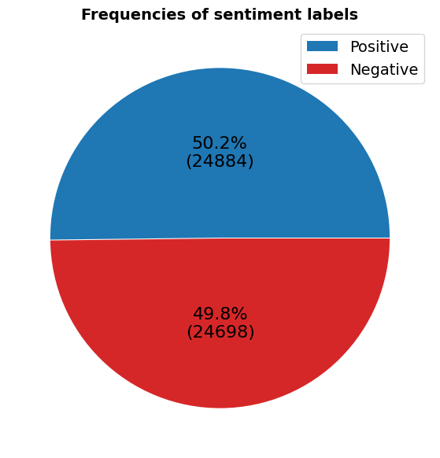
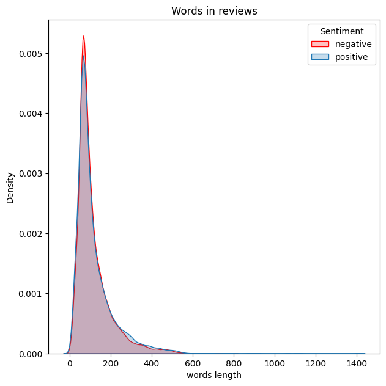

# Sentiment Analysis

## Project Overview

This project implements a **Sentiment Analysis** model designed to preprocess and classify text data. It transforms raw text into a clean format before applying sentiment classification techniques to label data as *positive* or *negative*.

## Key Features

- **Text Preprocessing**:
  - Expands contractions (e.g., "isn't" → "is not")
  - Removes HTML tags, emojis, and special characters
  - Applies tokenization, lemmatization, and stopword removal
  - Cleans and normalizes text by converting it to lowercase and removing punctuation

- **Sentiment Classification**: The model predicts sentiment polarity (positive/negative) after text preprocessing.

## System Requirements

- Python 3.x
- Required libraries: `nltk`, `beautifulsoup4`, `contractions`, `re`, `string`

## Installation

1. Clone the repository:
    ```bash
    git clone https://github.com/NguyenHuy190303/Sentiment-Analysis
    cd SentimentAnalysis
    ```

2. Install the required libraries:
    ```bash
    pip install -r requirements.txt
    ```

## Usage

### Text Preprocessing

The `preprocess_text` function applies several steps such as cleaning HTML, removing emojis, and lemmatizing words.

Example:
```python
from bs4 import BeautifulSoup
import nltk
import re
import string
nltk.download('stopwords')
nltk.download('wordnet')

def preprocess_text(text):
    # Clean and preprocess text
    soup = BeautifulSoup(text, "html.parser")
    text = soup.get_text()
    text = re.sub(r'http\S+', '', text)  # Remove URLs
    text = "".join([char.lower() for char in text if char not in string.punctuation])
    return text

cleaned_text = preprocess_text("I love this movie! 😊 It's absolutely amazing!")
print(cleaned_text)  # Output: "i love this movie its absolutely amazing"
```

### Sentiment Classification

After preprocessing, the cleaned text is passed to a classification model to predict whether the sentiment is positive or negative.

## Example Dataset

The notebook uses a dataset where each text entry is labeled with either positive or negative sentiment. The dataset is first preprocessed, and then the cleaned text is used to train or test the model.

## Illustrative Images

Below are some illustrative images of the project's results:

### Input Text


### Preprocessed Text


## Acknowledgements

- NLTK for providing powerful NLP tools
- BeautifulSoup for handling HTML content extraction
- Contractions library for text normalization